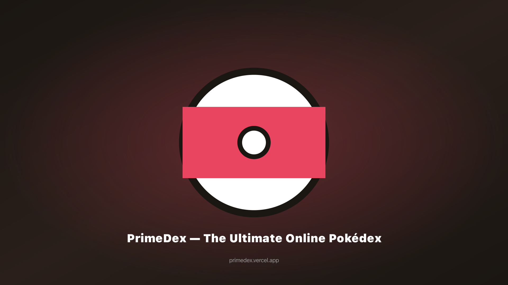
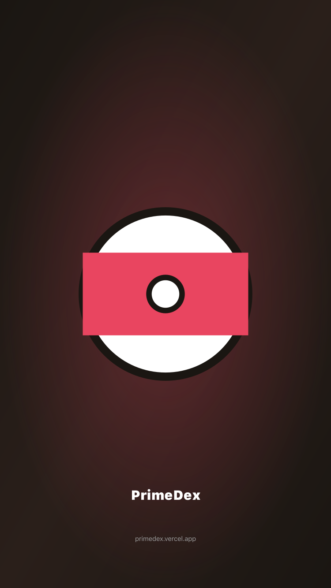

<!-- prettier-ignore -->
<div align="center">


# Lunidex

**Uno spazio Pokémon dedicato a giocatori, allenatori e collezionisti TCG.**

[](https://lunidex.app)
[](https://github.com/teefloo/Lunidex/actions/workflows/ci.yml)
[](https://nodejs.org/)
[](https://nextjs.org/)
[](https://react.dev/)
[](https://www.typescriptlang.org/)

[App online](https://lunidex.app) · [Repository](https://github.com/teefloo/Lunidex) · [Issue](https://github.com/teefloo/Lunidex/issues)

[Panoramica](#panoramica) · [Funzionalità](#funzionalità) · [Avvio rapido](#avvio-rapido) · [Configurazione](#configurazione) · [Architettura](#architettura) · [Distribuzione](#distribuzione)



</div>

<!-- README-I18N:START -->

[English](./README.md) · [Français](./README.fr.md) · [Español](./README.es.md) · [Deutsch](./README.de.md) · **Italiano** · [日本語](./README.ja.md) · [한국어](./README.ko.md) · [中文](./README.zh.md) · [Português](./README.pt.md)

<!-- README-I18N:END -->

## Panoramica

Lunidex è un monorepo npm-workspaces indipendente e open source che riunisce un Pokédex, strumenti di riferimento Pokémon, strumenti per creare squadre, un catalogo Pokémon TCG e uno spazio personale associato a un account.

L’app web include **1.025 Pokémon di nove generazioni** e supporta otto lingue dell’interfaccia: inglese, francese, spagnolo, tedesco, italiano, giapponese, coreano e cinese semplificato. Il portoghese è disponibile come README tradotto, ma non è una lingua dell’interfaccia web.

Le pagine di riferimento pubbliche funzionano senza account. Lo spazio personale — preferiti, Pokémon catturati, squadre, progressi del quiz, collezioni TCG, wishlist, ricerche salvate, note, mazzi e funzioni correlate — usa Neon Auth e Neon PostgreSQL quando sono configurati e sincronizzati. Le preferenze di visualizzazione web usano IndexedDB.

> [!NOTE]
> Lunidex è un progetto indipendente e non ufficiale realizzato dai fan. I nomi dei personaggi Pokémon, i marchi, le illustrazioni, le immagini e la relativa proprietà intellettuale appartengono ai rispettivi titolari. Lunidex non è affiliato, approvato, sponsorizzato né ufficialmente collegato a Nintendo, Creatures Inc., GAME FREAK inc. o The Pokémon Company.

<div align="center">
  
</div>

## Funzionalità

| Area | Cosa puoi fare |
| --- | --- |
| **Pokédex e riferimento** | Consultare e filtrare tutti i 1.025 Pokémon; vedere statistiche, tipi, abilità, mosse, evoluzioni, forme, incontri, sprite e dati localizzati sulle specie. Cercare mosse, abilità e strumenti. |
| **Laboratorio squadre e lotte** | Creare squadre fino a sei Pokémon, analizzare la copertura di tipi e mosse, controllare sinergie e ruoli, confrontare fino a tre Pokémon, usare la tabella dei 18 tipi, pianificare EV/IV, calcolare l’allevamento ed eseguire un simulatore di lotte di generazione 9. |
| **Progressi e gioco** | Tenere traccia di preferiti, Pokémon catturati, Living Dex, attività, medaglie e statistiche del quiz. Giocare con tre sfide e tre modalità, incluse le sessioni giornaliere, e seguire una partita Nuzlocke. |
| **Condivisione e funzioni social** | Importare ed esportare squadre Showdown, condividere link di squadre in sola lettura, creare profili pubblici, gestire amici, consultare le classifiche del quiz e usare stanze di lotta associate all’account. |
| **Spazio Pokémon TCG** | Sfogliare carte e set, filtrare il catalogo, confrontare carte, seguire carte possedute e desiderate, controllare i progressi dei set, salvare ricerche e note, creare mazzi e mostrare i campi prezzo quando TCGdex li fornisce. |
| **PWA e persistenza** | Installare l’app web come PWA. Il service worker memorizza nella cache il guscio dell’app e alcune risorse upstream per rendere più affidabili le visite successive, mentre i dati dell’account restano dietro l’API server. |

## Esplora l’app

Sostituisci `en` con una lingua supportata: `en`, `fr`, `es`, `de`, `it`, `ja`, `ko` o `zh`.

| Superficie | Route |
| --- | --- |
| Home | [`/en`](https://lunidex.app/en) |
| Pokédex | [`/en/pokedex`](https://lunidex.app/en/pokedex) |
| Dettaglio Pokémon | [`/en/pokemon/pikachu`](https://lunidex.app/en/pokemon/pikachu) |
| Team builder | [`/en/team`](https://lunidex.app/en/team) |
| Tabella dei tipi | [`/en/types`](https://lunidex.app/en/types) |
| Quiz | [`/en/quiz`](https://lunidex.app/en/quiz) |
| Simulatore di lotte | [`/en/battle`](https://lunidex.app/en/battle) |
| Catalogo TCG | [`/en/tcg`](https://lunidex.app/en/tcg) |
| Collezione TCG | [`/en/tcg/collection`](https://lunidex.app/en/tcg/collection) |
| Dashboard | [`/en/dashboard`](https://lunidex.app/en/dashboard) |

Collezione, dashboard, funzioni social e altri spazi personali possono richiedere una sessione di sincronizzazione autenticata.

## Avvio rapido

### Prerequisiti

- [Node.js](https://nodejs.org/) 22
- npm e il `package-lock.json` versionato
- [Git](https://git-scm.com/)

Clona il repository, installa i workspace e avvia l’app web:

```bash
git clone https://github.com/teefloo/Lunidex.git
cd Lunidex
npm ci
npm run dev
```

Apri [http://localhost:3000](http://localhost:3000). Il proxy delle lingue reindirizza un URL senza prefisso verso una lingua supportata come `/it`, usando il cookie `primedex-lang` o la lingua del browser quando disponibile.

> [!IMPORTANT]
> Le build di sviluppo e produzione usano intenzionalmente webpack: `npm run dev` esegue `next dev --webpack` e `npm run build` esegue `next build --webpack`. Mantieni l’opzione anche se la configurazione Next.js dichiara anche una root Turbopack.

## Configurazione

Non sono necessarie variabili d’ambiente per consultare le pagine pubbliche di riferimento. Copia il modello per attivare integrazioni opzionali per account, server, contatti, notifiche o sviluppo:

```bash
cp .env.example .env.local
```

| Variabile | Ambito | Scopo |
| --- | --- | --- |
| `NEXT_PUBLIC_APP_URL` | Web / pubblico | URL canonico del sito e base API. Predefinito: `https://lunidex.app`. |
| `NEXT_PUBLIC_NEON_AUTH_URL` | Web / pubblico | Endpoint Neon Auth usato dal client browser. |
| `NEON_AUTH_BASE_URL`, `NEON_AUTH_JWKS_URL` | Solo server | Endpoint del proxy Neon Auth e della verifica JWT. |
| `NEON_AUTH_COOKIE_SECRET`, `NEON_AUTH_JWT_ISSUER`, `NEON_AUTH_JWT_AUDIENCE` | Solo server | Protezione del cookie di autenticazione e vincoli di validazione JWT. |
| `NEON_DATABASE_URL` / `DATABASE_URL` | Solo server | Connessione PostgreSQL Neon. L’integrazione Neon di Vercel fornisce `DATABASE_URL`; in locale puoi usare `NEON_DATABASE_URL`. |
| `NEXT_PUBLIC_GOOGLE_VERIFICATION` | Web / pubblico | Valore opzionale per la verifica Google Search Console. |
| `NEXT_PUBLIC_ENABLE_AGENTATION` | Sviluppo | Attiva l’overlay di revisione UI Agentation quando vale `true`. |
| `NEXT_PUBLIC_VAPID_PUBLIC_KEY` | Web / pubblico | Chiave opzionale per gli abbonamenti alle notifiche push del browser. |
| `VAPID_PRIVATE_KEY`, `VAPID_SUBJECT` | Solo server | Configurazione opzionale per l’invio delle notifiche push lato server. |
| `RESEND_API_KEY`, `CONTACT_TO_EMAIL`, `CONTACT_FROM_EMAIL` | Solo server | Invio opzionale del modulo di contatto tramite Resend. |
| `SUPABASE_DB_URL` | Solo migrazione | Connessione sorgente per gli script conservati di esportazione Supabase-Neon; mai una variabile runtime web. |

> [!WARNING]
> Non esporre stringhe di connessione, impostazioni JWKS, segreti dei cookie, materiale VAPID privato, chiavi Resend o URL di migrazione tramite `NEXT_PUBLIC_*`, file sorgente, log o commit.

<details>
<summary><strong>Attivare Agentation durante lo sviluppo</strong></summary>

Aggiungi questo valore a `.env.local` e riavvia il server di sviluppo:

```dotenv
NEXT_PUBLIC_ENABLE_AGENTATION=true
```

Lo strumento usa `http://localhost:4747`; l’origine di sviluppo e il supporto CSP sono già configurati.

</details>

## Script

Esegui i comandi root dalla radice del repository:

| Comando | Descrizione |
| --- | --- |
| `npm run dev` | Avvia il server di sviluppo Next.js. |
| `npm run build` | Crea una build di produzione. |
| `npm run start` | Serve la build di produzione. |
| `npm run lint` | Esegue ESLint sui sorgenti web e core. |
| `npm run typecheck` | Controlla il workspace web. |
| `npx tsc --project packages/core/tsconfig.json --noEmit` | Controlla `@primedex/core`. |
| `npm run db:neon:export` | Esporta i dati della sorgente conservata per la migrazione. |
| `npm run db:neon:import` | Applica lo schema Neon e importa un export preparato. |
| `npm run db:neon:verify` | Confronta sorgente e risultato della migrazione Neon. |

> [!WARNING]
> I comandi di import e verifica Neon accedono a database esterni. Leggi [`neon/AGENTS.md`](./neon/AGENTS.md) e [`scripts/neon/AGENTS.md`](./scripts/neon/AGENTS.md) e usa una destinazione di test o staging approvata.

Il workflow CI in `.github/workflows/ci.yml` installa le dipendenze ed esegue lint, controllo dei tipi, verifica SEO e build di produzione.

## Architettura

```text
.
├── src/                 Applicazione web Next.js 16 / React 19
├── packages/core/       `@primedex/core`: tipi di dominio e helper per TCG/prodotti sigillati
├── neon/migrations/     Schema applicativo PostgreSQL Neon attivo
├── supabase/            Edge Function archiviata e materiale storico di sicurezza
├── scripts/neon/        Script controllati di export, import e verifica
├── public/              Icone PWA, screenshot, risorse per le carte e file statici
└── docs/                Note di prodotto, design, migrazione, audit e implementazione
```

```text
Web (Next.js App Router)
  ├── Componenti di route server e client
  ├── TanStack Query ──▶ client API condivisi ──▶ PokéAPI + TCGdex
  ├── Zustand ──▶ preferenze di visualizzazione IndexedDB
  └── Route Handlers ──▶ Neon Auth + spazio utente PostgreSQL Neon

```

Confini principali:

- **Web:** Next.js 16 App Router, React 19, TypeScript, Tailwind CSS 4, Base UI, Framer Motion, TanStack Query e livello PWA.
- **Core condiviso:** l’app web usa tipi di dominio portabili e helper puri per TCG/prodotti sigillati.
- **Accesso ai dati:** le richieste web passano dalla façade API centralizzata in src/lib/api; i componenti di presentazione non aggiungono client API ad hoc.
- **Persistenza:** le preferenze di visualizzazione web usano IndexedDB con fallback del browser. Lo spazio autenticato si sincronizza tramite l’API Neon e viene salvato in user_state.
- **Localizzazione:** route con prefisso locale e bundle di traduzione supportano `en`, `fr`, `es`, `de`, `it`, `ja`, `ko` e `zh`.

> [!IMPORTANT]
> Lunidex è il nome visibile del prodotto, ma primedex, `@primedex/core`, `usePrimeDexStore`, le chiavi di archiviazione, gli slug delle route e i domini pubblici esistenti sono identificatori storici sensibili alla compatibilità. Modificali solo con una migrazione deliberata.

## Fonti dati e attribuzione

| Fonte | Utilizzo |
| --- | --- |
| [PokéAPI](https://pokeapi.co/) REST e GraphQL | Pokémon, testi delle specie, statistiche, tipi, mosse, abilità, evoluzioni, incontri e nomi localizzati. |
| [PokéAPI sprites](https://github.com/PokeAPI/sprites) | Sprite di Pokémon e strumenti e risorse grafiche correlate. |
| [TCGdex](https://www.tcgdex.net/) | Carte Pokémon TCG, set, rarità, immagini, campi del catalogo e campi prezzo quando forniti dalla sorgente. |
| [Neon](https://neon.com/) | Autenticazione opzionale, stato utente PostgreSQL, profili, amici, classifiche, stanze di lotta e funzioni server dello spazio personale. |

La disponibilità delle fonti upstream, la copertura delle lingue, le immagini e i campi prezzo possono cambiare. Lunidex non è un marketplace di carte e non garantisce valutazioni di mercato né una copertura completa dello storico prezzi.

Il codice sorgente è distribuito con licenza MIT in [`LICENSE`](./LICENSE). La proprietà intellettuale Pokémon e i dati di terze parti restano soggetti ai rispettivi proprietari e termini.

## Distribuzione

Lunidex è configurato per [Vercel](https://vercel.com/) e può essere eseguito anche su un host che supporti il runtime server Next.js e l’ottimizzazione delle immagini.

```bash
npm run build
npm run start
```

Per Vercel:

1. Importa `teefloo/Lunidex` in un progetto Vercel.
2. Configura i valori Neon Auth e la connessione al database solo server in Preview e Production.
3. Usa le impostazioni di build standard di Next.js. Il [`vercel.json`](./vercel.json) versionato resta intenzionalmente minimale.

Il runtime web attivo usa Neon. Le migrazioni SQL Supabase non sono più conservate nel repository; questa directory contiene ora solo un’Edge Function archiviata e materiale storico di sicurezza. Gli script di migrazione controllati sono strumenti storici e non fanno parte del runtime di autenticazione o database dell’applicazione web.

Consulta il [runbook della migrazione Neon](./docs/neon-migration.md) per schema, confini degli ambienti e procedura di validazione.

## Documentazione correlata

- [Contesto del prodotto](./PRODUCT.md)
- [Sistema di design](./DESIGN.md)
- [Runbook della migrazione Neon](./docs/neon-migration.md)
- [Issue GitHub](https://github.com/teefloo/Lunidex/issues)
