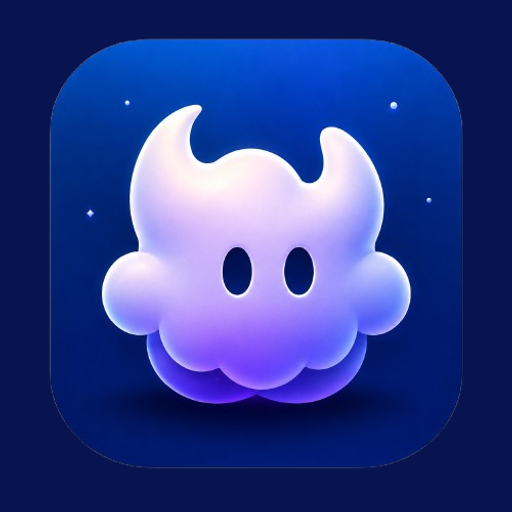
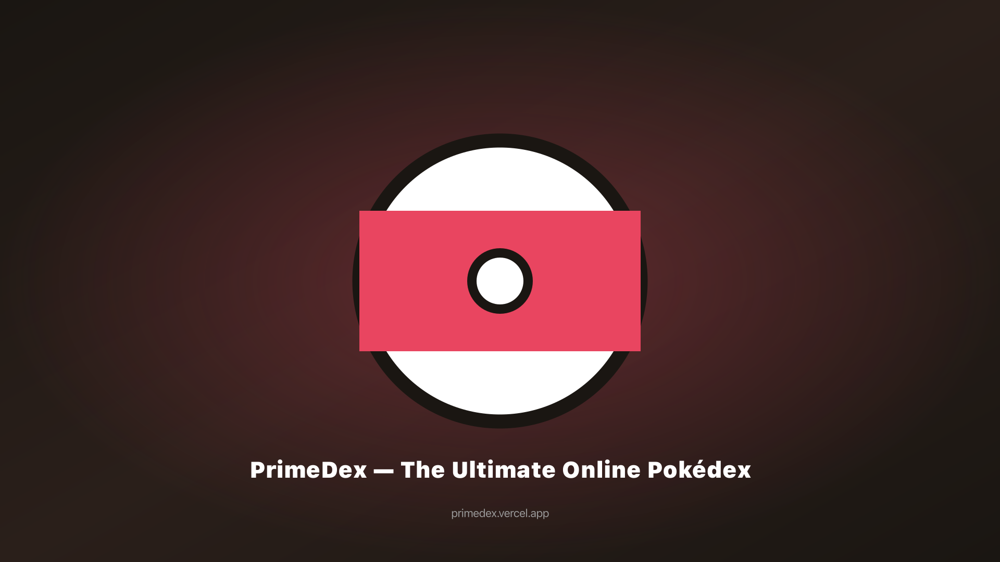
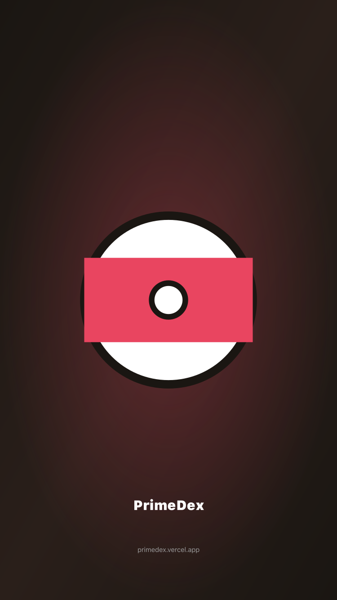

<!-- prettier-ignore -->
<div align="center">



# Lunidex

**Um espaço Pokémon focado para jogadores, treinadores e colecionadores TCG.**

[](https://lunidex.app)
[](https://github.com/teefloo/Lunidex/actions/workflows/ci.yml)
[](https://nodejs.org/)
[](https://nextjs.org/)
[](https://react.dev/)
[](https://www.typescriptlang.org/)
[](./apps/mobile)

[Aplicação online](https://lunidex.app) · [Repositório](https://github.com/teefloo/Lunidex) · [Issues](https://github.com/teefloo/Lunidex/issues)

[Visão geral](#visão-geral) · [Funcionalidades](#funcionalidades) · [Início rápido](#início-rápido) · [Configuração](#configuração) · [Arquitetura](#arquitetura) · [Implementação](#implementação)



</div>

<!-- README-I18N:START -->

[English](./README.md) · [Français](./README.fr.md) · [Español](./README.es.md) · [Deutsch](./README.de.md) · [Italiano](./README.it.md) · [日本語](./README.ja.md) · [한국어](./README.ko.md) · [中文](./README.zh.md) · **Português**

<!-- README-I18N:END -->

## Visão geral

O Lunidex é um monorepo npm-workspaces independente e open source que reúne um Pokédex, ferramentas de referência Pokémon, ferramentas de criação de equipas, um catálogo Pokémon TCG e um espaço pessoal associado a uma conta.

A aplicação web inclui **1.025 Pokémon de nove gerações** e suporta oito idiomas de interface: inglês, francês, espanhol, alemão, italiano, japonês, coreano e chinês simplificado. O português está disponível como README traduzido, mas não é um idioma da interface web.

As páginas públicas de referência funcionam sem conta. O espaço pessoal — favoritos, Pokémon capturados, equipas, progresso do quiz, coleções TCG, listas de desejos, pesquisas guardadas, notas, baralhos e funcionalidades relacionadas — utiliza Neon Auth e Neon PostgreSQL quando estão configurados e sincronizados. As preferências de visualização web usam IndexedDB; a aplicação Expo usa AsyncStorage.

> [!NOTE]
> O Lunidex é um projeto de fãs independente e não oficial. Os nomes de personagens Pokémon, marcas, ilustrações, imagens e a propriedade intelectual relacionada pertencem aos respetivos titulares. O Lunidex não é afiliado, aprovado, patrocinado nem oficialmente ligado à Nintendo, Creatures Inc., GAME FREAK inc. ou The Pokémon Company.

<div align="center">
  
</div>

## Funcionalidades

| Área | O que pode fazer |
| --- | --- |
| **Pokédex e referência** | Explorar e filtrar os 1.025 Pokémon; consultar estatísticas, tipos, habilidades, movimentos, evoluções, formas, encontros, sprites e dados de espécies localizados. Pesquisar movimentos, habilidades e itens. |
| **Laboratório de equipas e batalhas** | Criar equipas com até seis Pokémon, analisar a cobertura de tipos e movimentos, verificar sinergias e funções, comparar até três Pokémon, usar a tabela dos 18 tipos, planear EV/IV, calcular criação e executar um simulador de batalhas da geração 9. |
| **Progresso e jogo** | Acompanhar favoritos, Pokémon capturados, Living Dex, atividade, medalhas e estatísticas do quiz. Jogar com três desafios e três modos de jogo, incluindo partidas diárias, e acompanhar uma partida Nuzlocke. |
| **Partilha e funcionalidades sociais** | Importar e exportar equipas Showdown, partilhar links de equipas em modo só de leitura, criar perfis públicos, gerir amigos, consultar classificações do quiz e usar salas de batalha associadas à conta. |
| **Espaço Pokémon TCG** | Explorar cartas e conjuntos, filtrar o catálogo, comparar cartas, acompanhar cartas possuídas e desejadas, consultar o progresso de conjuntos, guardar pesquisas e notas, criar baralhos e apresentar campos de preço quando o TCGdex os disponibiliza. |
| **PWA e persistência** | Instalar a aplicação web como PWA. O service worker coloca em cache o shell da aplicação e recursos externos selecionados para visitas repetidas mais resilientes, enquanto os dados da conta permanecem atrás da API do servidor. |
| **Companheiro móvel** | Usar a aplicação Expo no iOS, Android ou web com clientes API, tipos, estado Zustand, contratos de persistência, traduções e helpers Neon partilhados através de `@primedex/core`. |

## Explorar a aplicação

Substitua `en` por um idioma suportado: `en`, `fr`, `es`, `de`, `it`, `ja`, `ko` ou `zh`.

| Superfície | Rota |
| --- | --- |
| Início | [`/en`](https://lunidex.app/en) |
| Pokédex | [`/en/pokedex`](https://lunidex.app/en/pokedex) |
| Detalhes de Pokémon | [`/en/pokemon/pikachu`](https://lunidex.app/en/pokemon/pikachu) |
| Criador de equipas | [`/en/team`](https://lunidex.app/en/team) |
| Tabela de tipos | [`/en/types`](https://lunidex.app/en/types) |
| Quiz | [`/en/quiz`](https://lunidex.app/en/quiz) |
| Simulador de batalhas | [`/en/battle`](https://lunidex.app/en/battle) |
| Catálogo TCG | [`/en/tcg`](https://lunidex.app/en/tcg) |
| Coleção TCG | [`/en/tcg/collection`](https://lunidex.app/en/tcg/collection) |
| Dashboard | [`/en/dashboard`](https://lunidex.app/en/dashboard) |

Coleção, dashboard, funcionalidades sociais e outras superfícies pessoais podem exigir uma sessão de sincronização autenticada.

## Início rápido

### Pré-requisitos

- [Node.js](https://nodejs.org/) 22
- npm e o `package-lock.json` versionado
- [Git](https://git-scm.com/)

Clone o repositório, instale os workspaces e inicie a aplicação web:

```bash
git clone https://github.com/teefloo/Lunidex.git
cd Lunidex
npm ci
npm run dev
```

Abra [http://localhost:3000](http://localhost:3000). O proxy de idioma redireciona um URL sem prefixo para um idioma suportado como `/en`, usando o cookie `primedex-lang` ou o idioma do navegador quando disponível.

> [!IMPORTANT]
> Os builds de desenvolvimento e produção usam webpack intencionalmente: `npm run dev` executa `next dev --webpack` e `npm run build` executa `next build --webpack`. Mantenha esta opção mesmo que a configuração do Next.js também declare uma raiz Turbopack.

## Aplicação móvel

O companheiro Expo encontra-se em [`apps/mobile`](./apps/mobile). Atualmente inclui a lista e pesquisa do Pokédex, páginas de detalhe, favoritos, equipas, conta, tema e definições de idioma. Ainda não tem paridade total com a web; as restantes ferramentas continuam disponíveis na aplicação Next.js.

Inicie-o a partir da raiz do repositório:

```bash
npm run start --workspace=@primedex/mobile
```

O menu Expo permite abrir iOS, Android ou uma pré-visualização web. O package também disponibiliza os scripts `android`, `ios` e `web`:

```bash
npm run android --workspace=@primedex/mobile
npm run ios --workspace=@primedex/mobile
npm run web --workspace=@primedex/mobile
```

Consulte o [README móvel](./apps/mobile/README.md) para variáveis de ambiente e notas de arquitetura específicas do Expo.

## Configuração

Não são necessárias variáveis de ambiente para consultar as páginas públicas de referência. Copie o modelo para ativar integrações opcionais de conta, servidor, contacto, notificações ou desenvolvimento:

```bash
cp .env.example .env.local
```

Para a aplicação Expo, use `apps/mobile/.env.example` como modelo:

```bash
cp apps/mobile/.env.example apps/mobile/.env
```

| Variável | Âmbito | Finalidade |
| --- | --- | --- |
| `NEXT_PUBLIC_APP_URL` | Web / público | URL canónico do site e base da API. Por predefinição: `https://lunidex.app`. |
| `NEXT_PUBLIC_NEON_AUTH_URL` | Web / público | Endpoint Neon Auth utilizado pelo cliente do navegador. |
| `NEON_AUTH_BASE_URL`, `NEON_AUTH_JWKS_URL` | Apenas servidor | Endpoints do proxy Neon Auth e da verificação JWT. |
| `NEON_AUTH_COOKIE_SECRET`, `NEON_AUTH_JWT_ISSUER`, `NEON_AUTH_JWT_AUDIENCE` | Apenas servidor | Proteção do cookie de autenticação e restrições de validação JWT. |
| `NEON_DATABASE_URL` / `DATABASE_URL` | Apenas servidor | Ligação PostgreSQL Neon. A integração Neon da Vercel fornece `DATABASE_URL`; localmente pode usar `NEON_DATABASE_URL`. |
| `EXPO_PUBLIC_NEON_AUTH_URL`, `EXPO_PUBLIC_APP_URL` | Móvel / público | Endpoints Neon Auth e da aplicação implementada utilizados pelo Expo. |
| `NEXT_PUBLIC_GOOGLE_VERIFICATION` | Web / público | Valor opcional de verificação do Google Search Console. |
| `NEXT_PUBLIC_ENABLE_AGENTATION` | Desenvolvimento | Ativa o overlay de revisão UI Agentation quando o valor é `true`. |
| `NEXT_PUBLIC_VAPID_PUBLIC_KEY` | Web / público | Chave opcional para subscrições de notificações push do navegador. |
| `VAPID_PRIVATE_KEY`, `VAPID_SUBJECT` | Apenas servidor | Configuração opcional de entrega push no servidor. |
| `RESEND_API_KEY`, `CONTACT_TO_EMAIL`, `CONTACT_FROM_EMAIL` | Apenas servidor | Envio opcional do formulário de contacto através do Resend. |
| `SUPABASE_DB_URL` | Apenas migração | Ligação à fonte conservada usada pelos scripts de exportação Supabase-Neon; nunca uma variável runtime web ou móvel. |

> [!WARNING]
> Nunca exponha strings de ligação, definições JWKS, segredos de cookies, material privado VAPID, chaves Resend ou URLs de migração através de `NEXT_PUBLIC_*`, `EXPO_PUBLIC_*`, ficheiros de origem, logs ou commits.

<details>
<summary><strong>Ativar Agentation durante o desenvolvimento</strong></summary>

Adicione este valor a `.env.local` e reinicie o servidor de desenvolvimento:

```dotenv
NEXT_PUBLIC_ENABLE_AGENTATION=true
```

A ferramenta utiliza `http://localhost:4747`; a origem de desenvolvimento e o suporte CSP já estão configurados.

</details>

## Scripts

Execute os comandos da raiz a partir da raiz do repositório:

| Comando | Descrição |
| --- | --- |
| `npm run dev` | Inicia o servidor de desenvolvimento Next.js. |
| `npm run build` | Cria um build de produção. |
| `npm run start` | Serve o build de produção. |
| `npm run lint` | Analisa as fontes web, core e mobile. |
| `npm run typecheck` | Verifica o workspace web. |
| `npm run test -- --run` | Executa a suite Vitest uma vez. |
| `npx vitest run path/to/file.test.ts` | Executa um ficheiro de testes específico. |
| `npx tsc --project packages/core/tsconfig.json --noEmit` | Verifica `@primedex/core`. |
| `npm run typecheck --workspace=@primedex/mobile` | Verifica a aplicação Expo. |
| `npm run lint --workspace=@primedex/mobile` | Analisa a aplicação Expo. |
| `npm run db:neon:export` | Exporta os dados da fonte conservada para migração. |
| `npm run db:neon:import` | Aplica o esquema Neon e importa um export preparado. |
| `npm run db:neon:verify` | Compara a fonte e o resultado da migração Neon. |

> [!WARNING]
> Os comandos de importação e verificação Neon acedem a bases de dados externas. Leia [`neon/AGENTS.md`](./neon/AGENTS.md) e [`scripts/neon/AGENTS.md`](./scripts/neon/AGENTS.md) e utilize um destino de teste ou staging aprovado.

O workflow CI em [`.github/workflows/ci.yml`](./.github/workflows/ci.yml) instala as dependências e executa lint, verificações de tipos web/core, testes, o build de produção e a verificação de tipos mobile.

## Arquitetura

```text
.
├── src/                 Aplicação web Next.js 16 / React 19
├── packages/core/       @primedex/core: clientes API, tipos, store, i18n e helpers partilhados
├── apps/mobile/         Companheiro Expo Router @primedex/mobile
├── neon/migrations/     Esquema de aplicação PostgreSQL Neon ativo
├── supabase/            Migrações fonte conservadas e material de compatibilidade
├── scripts/neon/        Scripts controlados de exportação, importação e verificação
├── public/              Ícones PWA, capturas, recursos de cartas e ficheiros estáticos
└── docs/                Notas de produto, design, migração, auditoria e implementação
```

```text
Web (Next.js App Router)
  ├── Componentes de rotas de servidor e cliente
  ├── TanStack Query ──▶ clientes API partilhados ──▶ PokéAPI + TCGdex
  ├── Zustand ──▶ preferências de visualização IndexedDB
  └── Route Handlers ──▶ Neon Auth + espaço de utilizador PostgreSQL Neon

Mobile (Expo Router)
  └── @primedex/core ──▶ AsyncStorage + Neon Auth/API quando configurados
```

Limites principais:

- **Web:** Next.js 16 App Router, React 19, TypeScript, Tailwind CSS 4, Base UI, Framer Motion, TanStack Query e a camada PWA.
- **Core partilhado:** tipos de domínio independentes da UI, clientes API, store Zustand, bundles i18n, helpers Neon e utilitários puros partilhados pela web e mobile.
- **Acesso a dados:** os pedidos remotos passam pela fachada API centralizada em `src/lib/api` e `packages/core/src/api`; os componentes de apresentação não criam clientes API ad hoc.
- **Persistência:** as preferências de visualização web usam IndexedDB com fallback do navegador; a persistência nativa usa AsyncStorage. O espaço autenticado é sincronizado através da API Neon e armazenado em `user_state`.
- **Camada de plataforma:** adaptadores correspondentes `*.ts` e `*.native.ts` separam armazenamento e configuração de browser/React Native sem duplicar a lógica de domínio.
- **Localização:** rotas com prefixo e bundles de tradução suportam `en`, `fr`, `es`, `de`, `it`, `ja`, `ko` e `zh`.

> [!IMPORTANT]
> Lunidex é o nome visível do produto, mas `primedex`, `@primedex/core`, `@primedex/mobile`, `usePrimeDexStore`, as chaves de armazenamento, os slugs de rotas, os schemes Expo e os identificadores de bundle são identificadores históricos sensíveis à compatibilidade. Não os altere sem uma migração deliberada.

## Fontes de dados e atribuição

| Fonte | Utilização |
| --- | --- |
| [PokéAPI](https://pokeapi.co/) REST e GraphQL | Pokémon, textos de espécies, estatísticas, tipos, movimentos, habilidades, evoluções, encontros e nomes localizados. |
| [PokéAPI sprites](https://github.com/PokeAPI/sprites) | Sprites de Pokémon e itens e recursos de ilustração relacionados. |
| [TCGdex](https://www.tcgdex.net/) | Cartas Pokémon TCG, conjuntos, raridades, imagens, campos de catálogo e campos de preço quando fornecidos pela fonte. |
| [Neon](https://neon.com/) | Autenticação opcional, estado de utilizador PostgreSQL, perfis, amigos, classificações, salas de batalha e funcionalidades de espaço pessoal no servidor. |

A disponibilidade das fontes externas, a cobertura localizada, as imagens e os campos de preço podem mudar. O Lunidex não é um marketplace de cartas e não garante avaliações de mercado nem cobertura completa de histórico de preços.

O código-fonte é distribuído sob a licença MIT em [`LICENSE`](./LICENSE). A propriedade intelectual Pokémon e os dados de terceiros continuam sujeitos aos respetivos titulares e condições.

## Implementação

O Lunidex está configurado para [Vercel](https://vercel.com/) e também pode funcionar num host que suporte o runtime de servidor Next.js e a otimização de imagens.

```bash
npm run build
npm run start
```

Na Vercel:

1. Importe `teefloo/Lunidex` para um projeto Vercel.
2. Configure os valores Neon Auth e a ligação à base de dados apenas do servidor em Preview e Production.
3. Use as definições de build padrão do Next.js. O [`vercel.json`](./vercel.json) versionado mantém-se intencionalmente mínimo.

O runtime web ativo utiliza Neon. As migrações Supabase conservadas e os scripts de migração controlados existem para comparação, cópias de segurança e trabalho de migração; não são o runtime de autenticação ou de base de dados da aplicação web.

Consulte o [runbook de migração Neon](./docs/neon-migration.md) para o esquema, os limites de ambiente e o procedimento de validação.

## Documentação relacionada

- [Configuração e notas de paridade mobile](./apps/mobile/README.md)
- [Contexto do produto](./PRODUCT.md)
- [Sistema de design](./DESIGN.md)
- [Runbook de migração Neon](./docs/neon-migration.md)
- [Issues no GitHub](https://github.com/teefloo/Lunidex/issues)
